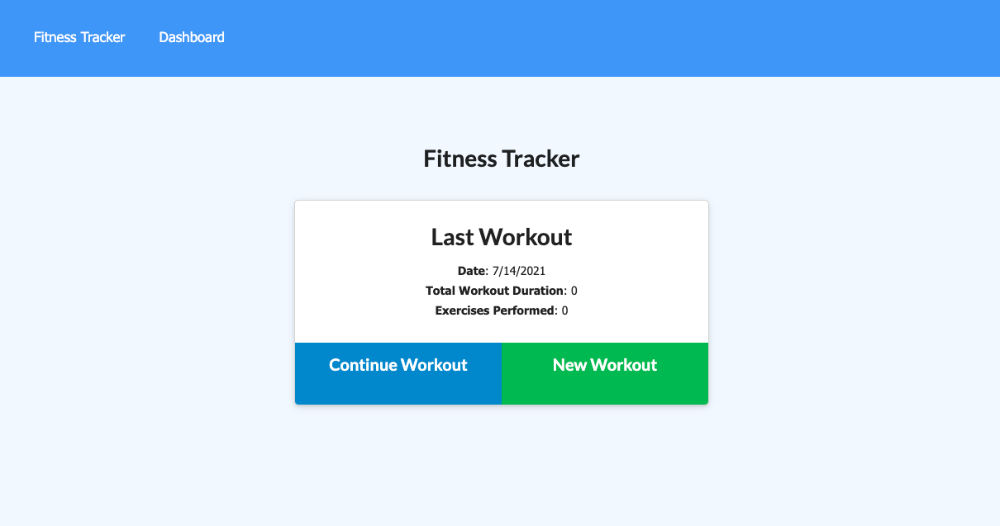
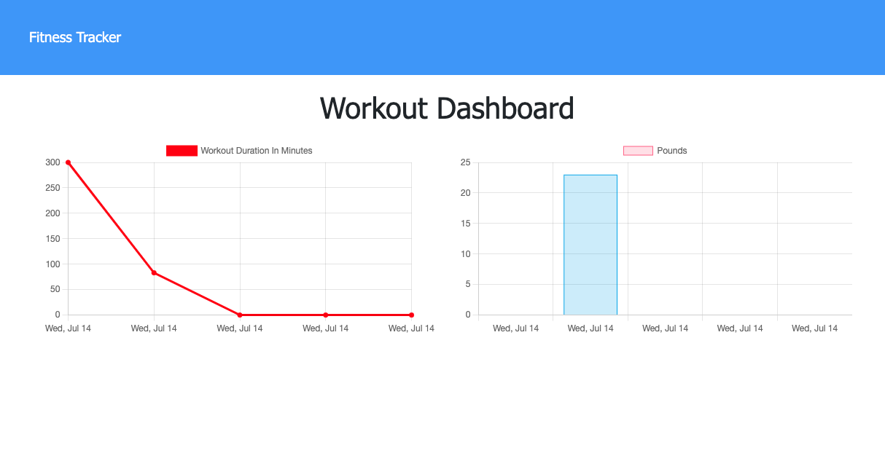
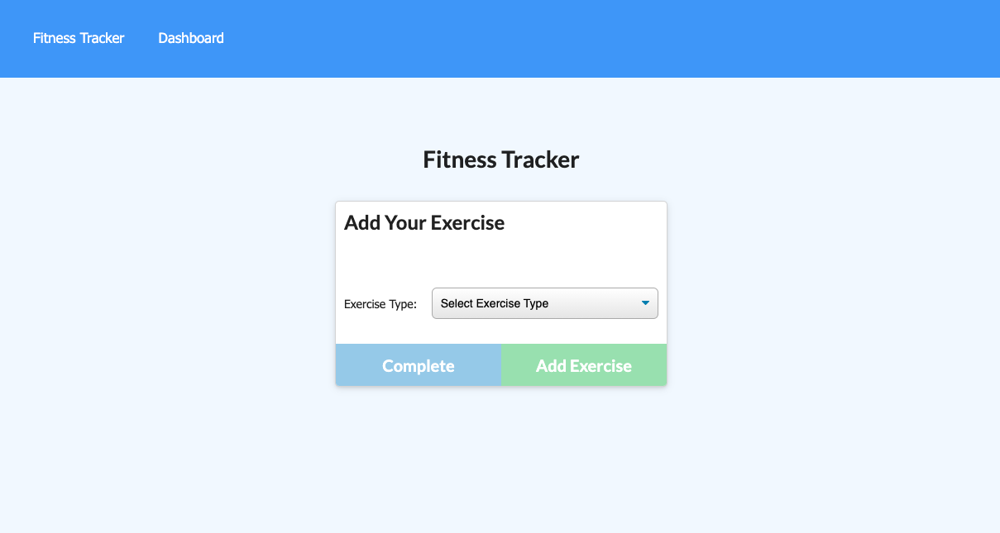
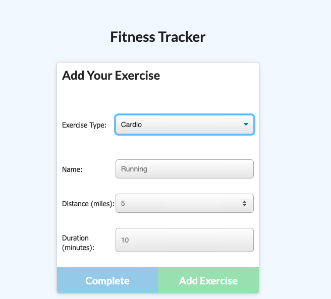
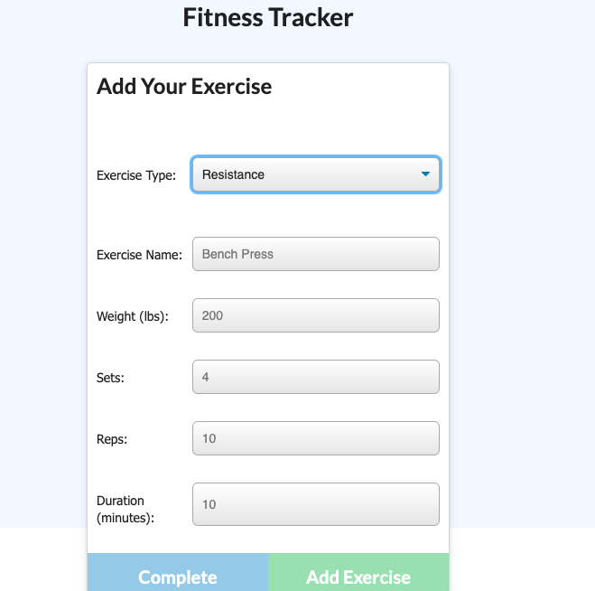

# Unit 18 Nosql Homework: Workout Tracker

For this assignment, I created a workout tracker. This assignment used a Mongo Database and was deployed using Heroku

## Deployed Link

https://h18-fitness-tracker.herokuapp.com/

## Screenshot

